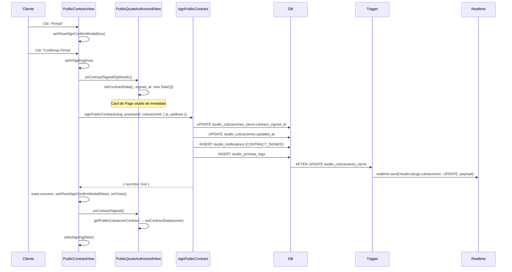
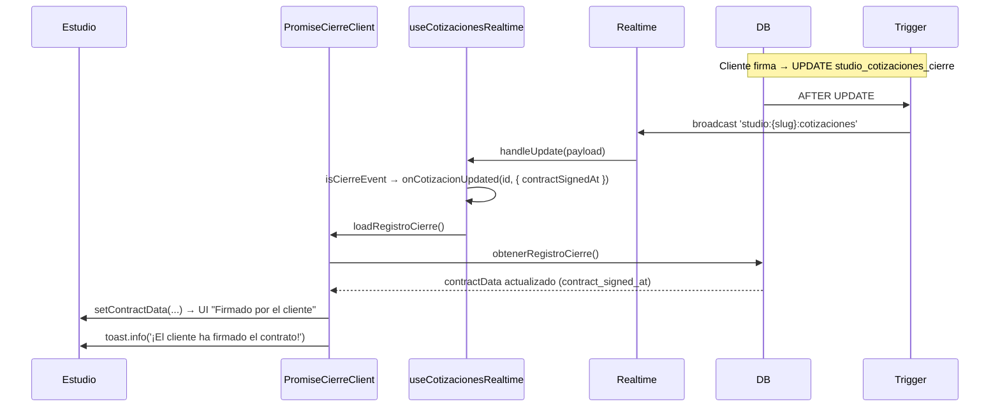
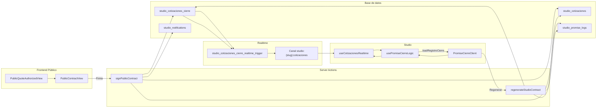

# Fuente Única de la Verdad: Arquitectura del Flujo de Contratos (Cierre Comercial)

Documento maestro que describe el flujo completo de **generación**, **firma** y **regeneración** de contratos en la plataforma Zen, desde la base de datos hasta el frontend público y el Studio.

---

## 1. Resumen Ejecutivo

### Propósito del flujo de contratos

El flujo de contratos pertenece al **Cierre Comercial**: una vez que el prospecto elige una cotización y el estudio la pasa a cierre, se genera un contrato (automático o manual). El cliente lo revisa y firma desde una URL pública; tras la firma puede registrar el pago y el estudio puede autorizar la promesa y crear el evento.

- **Fuente de verdad de la firma:** `studio_cotizaciones_cierre.contract_signed_at`.
- **Indicador de contrato listo:** `studio_cotizaciones_cierre.contrato_definido` y `contract_content` no nulo.
- El **status** de la cotización (`studio_cotizaciones.status`) permanece en `en_cierre` durante firma y pago; no se cambia a un estado intermedio "contract_signed".

### Flujo automático vs manual

| Aspecto | Automático | Manual |
|--------|------------|--------|
| **Cuándo** | El estudio define condiciones comerciales y plantilla; el sistema genera el contrato al pasar a cierre (o al guardar contrato). | El estudio genera/edita el contrato manualmente desde la vista de cierre. |
| **Origen del contenido** | Plantilla + datos de la promesa/cotización renderizados por `renderContractContent`. | Edición en Studio; se persiste en `studio_cotizaciones_cierre.contract_content`. |
| **Versión** | Se puede auto-incrementar en regeneraciones automáticas. | Se incrementa en "Regenerar contrato" desde Studio. |
| **Firma** | Igual en ambos: el cliente firma desde la vista pública; `signPublicContract` actualiza `contract_signed_at`. | Igual. |

En ambos casos la **firma** y la **regeneración** comparten las mismas Server Actions y la misma lógica de Realtime.

---

## 2. Arquitectura de Base de Datos

### Tablas involucradas

| Tabla | Rol en el flujo de contratos |
|-------|------------------------------|
| **studio_cotizaciones** | Cotización en cierre (`status` ∈ `contract_generated`, `en_cierre`, `cierre`). Se actualiza `updated_at` al firmar/regenerar para tocar el registro; no se cambia `status` por la firma. |
| **studio_cotizaciones_cierre** | Registro 1:1 por cotización en cierre. Contiene `contract_template_id`, `contract_content`, `contract_version`, **`contract_signed_at`** (fuente de verdad de la firma), `contrato_definido`, condiciones y datos de pago. |
| **studio_cotizaciones_cierre_contract_versions** | Historial de versiones del contrato (contenido anterior al regenerar). `change_type`: `STUDIO_REGENERATE`, `AUTO_REGENERATE`, etc. |
| **studio_notifications** | Notificación al estudio cuando el cliente firma (`CONTRACT_SIGNED`). Incluye `quote_id`, `contact_id`, `metadata.signed_ip`. |
| **studio_promise_logs** | Log de auditoría: "Cliente firmó el contrato…" o "El estudio regeneró el contrato. Firma previa invalidada". |

### Trigger Realtime: `studio_cotizaciones_cierre_realtime_trigger`

- **Función:** `studio_cotizaciones_cierre_broadcast_trigger()`.
- **Evento:** `AFTER INSERT OR UPDATE OR DELETE ON studio_cotizaciones_cierre` (por fila).
- **Lógica:**
  1. Obtiene `studio_slug` desde `studio_cotizaciones` + `studios` usando `NEW.cotizacion_id` o `OLD.cotizacion_id`.
  2. Construye un payload JSONB con `operation`, `table: 'studio_cotizaciones_cierre'`, `new`, `old`, `record`, `old_record`.
  3. Llama a `realtime.send(payload, TG_OP, 'studio:' || studio_slug || ':cotizaciones', false)`.
- **Canal:** `studio:{slug}:cotizaciones` (mismo canal que los cambios en `studio_cotizaciones`).
- **Migración:** `supabase/migrations/20260101235900_enable_realtime_cotizaciones_cierre.sql`.

Así, cualquier UPDATE en `studio_cotizaciones_cierre` (por ejemplo al firmar o regenerar) emite un evento broadcast en ese canal, sin depender de `auth.uid()`.

---

## 3. Ciclo de Vida de la Firma (Frontend Público)

### Componentes

- **PublicQuoteAuthorizedView**  
  Vista principal de cierre público: muestra cards de contrato, pago, datos bancarios, etc. Mantiene estado local `contractData` (incl. `signed_at`). Orquesta el modal de contrato, los callbacks optimistas y el refetch tras firma.

- **PublicContractView**  
  Modal (ZenDialog) que muestra el contrato (ContractPreview), botón "Firmar", confirmación y estado "Firmando...". Llama a `signPublicContract` y a los callbacks `onContractSignedOptimistic`, `onContractSigned`, `onContractSignedRollback`.

### Estados críticos

| Estado | Dónde | Significado |
|--------|-------|-------------|
| **isSigning** | `PublicContractView` | `true` desde que el usuario confirma la firma hasta que termina la Server Action. El modal no se puede cerrar; el botón muestra "Firmando..." y Loader2. |
| **isSuccess** | `PublicContractView` | `true` tras firma exitosa; usado para cerrar el modal y mostrar feedback. Se resetea si el contrato deja de estar firmado (p. ej. regenerado). |

### UX de firma

1. **Modal de confirmación:** "¿Confirmar firma del contrato?"  
   - Se abre con `setShowSignConfirmModal(true)` al hacer clic en "Firmar".  
   - Al confirmar, se llama `handleConfirmSign`: primero **optimistic update** (`onContractSignedOptimistic()` → `contractData.signed_at = new Date()`), luego fetch de IP (ipify), luego `signPublicContract(...)`.

2. **Bloqueo durante la firma:**  
   - `isSigning === true` → `onClose` no cierra el modal (`!isSigning && onClose()`).  
   - Botón "Confirmar Firma" deshabilitado y con texto "Firmando..." + Loader2.

3. **Feedback de éxito:**  
   - Tras `result.success`: `toast.success('Contrato firmado exitosamente')`, `setShowSignConfirmModal(false)`, `onClose()`, `onContractSigned()` dentro de `startTransition`.  
   - En `PublicQuoteAuthorizedView`, `handleContractSigned` hace refetch con `getPublicCotizacionContract` y actualiza `contractData`; `clearNavigating(500)` retrasa 500 ms la liberación del estado de navegación post-firma.

### Transición al Card de Pago

- El **optimistic update** ya puso `contractData.signed_at = new Date()` antes de la Server Action, por lo que al cerrar el modal la vista muestra de inmediato el card de Pago (y datos bancarios si aplica).
- `onContractSigned()` sincroniza con el servidor vía `getPublicCotizacionContract` y actualiza `contractData` con `signed_at` del servidor, evitando desincronización si la respuesta tarda.

---

## 4. Gestión desde el Studio

### Regenerar contrato

- **Acción:** `regenerateStudioContract(studioSlug, promiseId, cotizacionId)` (desde ContratoDigitalCard / usePromiseCierreLogic).
- **Efectos:**
  1. Valida studio, cotización y que exista registro de cierre con `contrato_definido` y `contract_template_id`.
  2. Obtiene plantilla y datos de la promesa; renderiza nuevo contenido con `renderContractContent`.
  3. Si ya hay `contract_content`, guarda la versión actual en `studio_cotizaciones_cierre_contract_versions` (solo si no existe ya esa versión) con `change_type: 'STUDIO_REGENERATE'`, `change_reason: 'El estudio regeneró el contrato. Firma previa invalidada'`.
  4. **UPDATE** `studio_cotizaciones_cierre`: `contract_content` = nuevo HTML, `contract_version` = `currentVersion + 1`, **`contract_signed_at` = null** (invalida la firma previa).
  5. UPDATE `studio_cotizaciones.updated_at`.
  6. INSERT `studio_promise_logs` ("El estudio regeneró el contrato. Firma previa invalidada").
  7. Revalida paths y tags de caché públicos y del studio.

El trigger Realtime emite un UPDATE en `studio:{slug}:cotizaciones`, por lo que los clientes suscritos (público y studio) pueden reaccionar.

### Sincronización Real-time en el Studio

- **Hook:** `useCotizacionesRealtime` en `usePromiseCierreLogic` con `ignoreCierreEvents: false`.
- **Canal:** mismo `studio:{slug}:cotizaciones`.
- **Comportamiento:**  
  En eventos con `table === 'studio_cotizaciones_cierre'`, el hook llama a `onCotizacionUpdated(cotizacionId, changeInfo)`. En `usePromiseCierreLogic`, el callback:
  1. Filtra por `updatedCotizacionId === cotizacion.id`.
  2. Llama a `loadRegistroCierre()` → `obtenerRegistroCierre` → actualiza `contractData`, `pagoData`, `condicionesData`, etc.
  3. Si `changeInfo.contractSignedAt` está definido y no se mostró un toast reciente (2 s), muestra `toast.info('¡El cliente ha firmado el contrato!')`.

Así, cuando el cliente firma, el estudio ve actualizado el ContratoDigitalCard (y el estado "Firmado") sin refrescar la página.

---

## 5. Acciones del Servidor (Server Actions)

### signPublicContract

- **Archivo:** `src/lib/actions/public/contracts.actions.ts`.
- **Firma:** `signPublicContract(studioSlug, promiseId, cotizacionId, data: { ip_address })`.
- **Validación:** Zod `SignPublicContractSchema` (ip_address).
- **Flujo:**
  1. Buscar studio por slug.
  2. Buscar cotización por id, promise_id, studio_id y status ∈ `contract_generated` | `en_cierre` | `cierre`; incluir `cotizacion_cierre` (contrato_definido, contract_content, contract_signed_at).
  3. Si no existe o no está en cierre → error.
  4. Si `contrato_definido` es false o ya hay `contract_signed_at` → error.
  5. UPDATE `studio_cotizaciones_cierre` SET `contract_signed_at = new Date()`.
  6. UPDATE `studio_cotizaciones` SET `updated_at = new Date()` (no cambia status).
  7. `createStudioNotification(CONTRACT_SIGNED, …)` con contact, quote_id, metadata.signed_ip.
  8. INSERT `studio_promise_logs` (content: "Cliente firmó el contrato de la cotización: …", metadata: action, cotizacion_id, signed_ip).
  9. revalidatePath (público y studio) y revalidateTag (`public-promise-*`, `public-promise-route-state-*`, `public-promise-cierre-*`).
  10. Return `{ success: true }`.

### regenerateStudioContract

- **Archivo:** `src/lib/actions/studio/commercial/promises/cotizaciones-cierre.actions.ts`.
- **Firma:** `regenerateStudioContract(studioSlug, promiseId, cotizacionId)`.
- **Flujo:**
  1. Validar studio y cotización; cargar registro de cierre con condiciones.
  2. Si no hay contrato generado (`contrato_definido`, `contract_template_id`) → error.
  3. Obtener plantilla y datos de la promesa; renderizar nuevo contenido.
  4. Versión actual → guardar en `studio_cotizaciones_cierre_contract_versions` si no existe (change_type `STUDIO_REGENERATE`).
  5. UPDATE `studio_cotizaciones_cierre`: nuevo `contract_content`, `contract_version` incrementado, **`contract_signed_at = null`**.
  6. UPDATE `studio_cotizaciones.updated_at`.
  7. INSERT `studio_promise_logs` ("El estudio regeneró el contrato. Firma previa invalidada").
  8. revalidatePath y revalidateTag (studio y público).
  9. Return `{ success: true, data: { id, cotizacion_id } }`.

**Notificaciones:** `signPublicContract` crea notificación al estudio; `regenerateStudioContract` no crea notificación (solo log).

---

## 6. Optimizaciones de Rendimiento

### Vista de cierre (Studio)

- **Promise.all en page:** En `src/app/[slug]/studio/commercial/promises/[promiseId]/cierre/page.tsx`, las queries independientes se ejecutan en paralelo:
  - `determinePromiseState(promiseId)`
  - `getCotizacionesByPromiseId(promiseId)`  
  Así se evita esperar secuencialmente antes de redirigir o renderizar.

### Vista de cierre (Público)

- **Streaming y Suspense:** La página pública de cierre (`src/app/[slug]/promise/[promiseId]/cierre/page.tsx`) no espera todos los datos a la vez:
  - Primero se valida ruta con `getPublicPromiseRouteState` y se cargan datos básicos con `getPublicPromiseBasicData`.
  - Los datos pesados de cierre se cargan con una promesa diferida: `getPublicPromiseCierre(slug, promiseId)` sin await.
  - `<Suspense fallback={<CierrePageSkeleton />}>` envuelve a `CierrePageDeferred`, que usa `use(dataPromise)` (React 19). Así el shell y la sincronización de ruta se muestran pronto y el contenido de cierre se rellena cuando llega.

### Studio: Skeletons por sección

- En `PromiseCierreClient`, cada bloque (Cotización, Contrato, Pago) está envuelto en su propio `<Suspense fallback={<…Skeleton />}>` (CotizacionCardSkeleton, ContratoDigitalCardSkeleton, PagoInicialCardSkeleton), de modo que el layout no se bloquea y se evita layout shift mientras `loadRegistroCierre` o datos hijos resuelven.

---

## 7. Glosario de Archivos Clave

| Rol | Ruta |
|-----|------|
| Página pública cierre | `src/app/[slug]/promise/[promiseId]/cierre/page.tsx` |
| Deferred (datos pesados + use()) | `src/app/[slug]/promise/[promiseId]/cierre/CierrePageDeferred.tsx` |
| Skeleton público cierre | `src/app/[slug]/promise/[promiseId]/cierre/CierrePageSkeleton.tsx` |
| Vista autorizada (contrato + firma + pago) | `src/components/promise/PublicQuoteAuthorizedView.tsx` |
| Modal contrato + botón Firmar | `src/components/promise/PublicContractView.tsx` |
| Server Action firma pública | `src/lib/actions/public/contracts.actions.ts` → `signPublicContract` |
| Server Action regenerar (studio) | `src/lib/actions/studio/commercial/promises/cotizaciones-cierre.actions.ts` → `regenerateStudioContract` |
| Página cierre studio | `src/app/[slug]/studio/commercial/promises/[promiseId]/cierre/page.tsx` |
| Cliente cierre studio (Suspense + cards) | `src/app/[slug]/studio/commercial/promises/[promiseId]/cierre/components/PromiseCierreClient.tsx` |
| Lógica cierre studio (Realtime + loadRegistroCierre) | `src/app/[slug]/studio/commercial/promises/[promiseId]/cierre/components/usePromiseCierreLogic.tsx` |
| Card contrato en estudio | `src/app/[slug]/studio/commercial/promises/[promiseId]/cierre/components/ContratoDigitalCard.tsx` |
| Skeletons studio cierre | `src/app/[slug]/studio/commercial/promises/[promiseId]/cierre/components/PromiseCierreSkeleton.tsx` |
| Hook Realtime cotizaciones/cierre | `src/hooks/useCotizacionesRealtime.ts` |
| Trigger DB cierre | `supabase/migrations/20260101235900_enable_realtime_cotizaciones_cierre.sql` |
| Obtención registro cierre | `src/lib/actions/studio/commercial/promises/cotizaciones-cierre.actions.ts` → `obtenerRegistroCierre` |
| Datos contrato público (refetch) | `src/lib/actions/public/promesas.actions.ts` → `getPublicCotizacionContract` |

---

## Diagrama global Cliente ↔ DB ↔ Studio

Este documento es la **fuente única de verdad** para la arquitectura del flujo de contratos (generación, firma y regeneración) en Zen. Cualquier cambio de comportamiento o de esquema debe reflejarse aquí.
